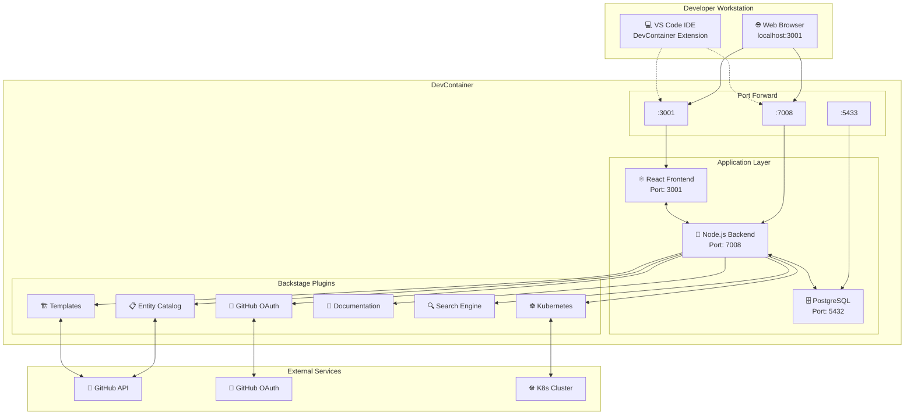
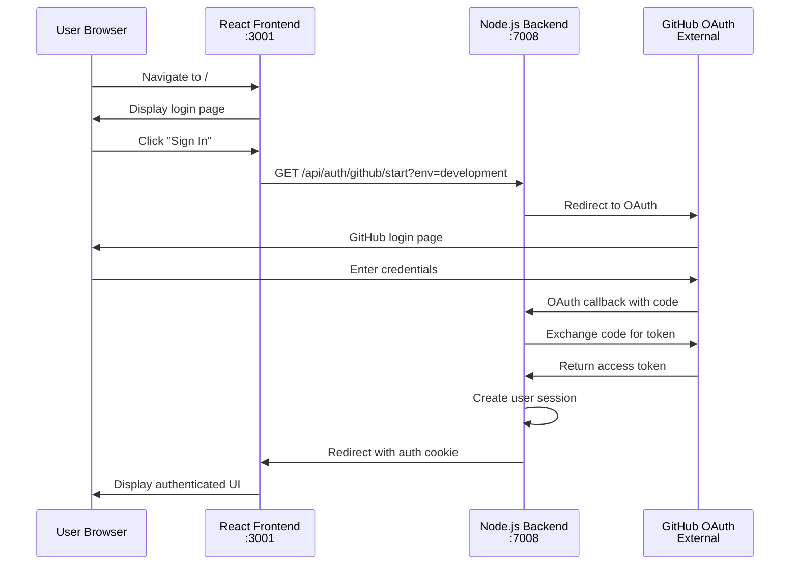
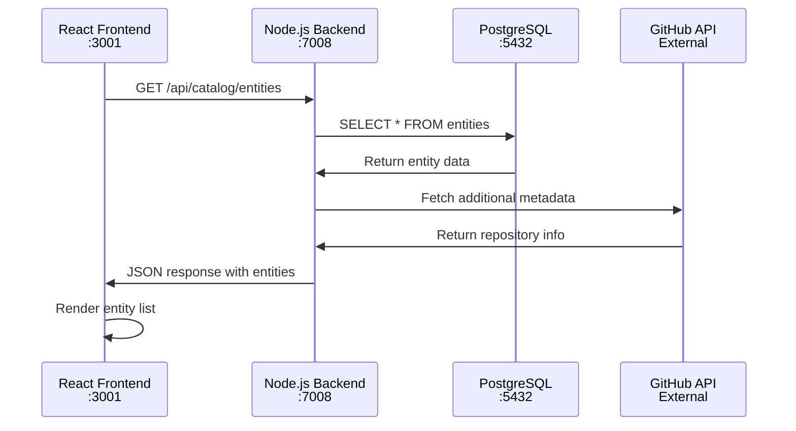

# 🏗️ Backstage DevOps Course - Architecture Guide

## System Architecture Diagram

### High-Level Architecture (ASCII)

```
┌─ Developer Machine ─────────────────────────────────────────────────────┐
│  ┌─ VS Code ─┐    ┌─ Web Browser ─┐                                      │
│  │DevContainer│    │  Frontend UI  │                                      │
│  │Extensions  │    │ localhost:3001│                                      │
│  └─────┬──────┘    └──────┬────────┘                                      │
│        │                  │                                               │
│        ▼                  ▼                                               │
│  ┌─ Port Forwarding ──────────────────────────────────────────────────┐  │
│  │  3001 ──► Frontend     7008 ──► Backend     5433 ──► PostgreSQL    │  │
│  └─────┬────────────────────┬─────────────────────┬──────────────────┘  │
└────────┼────────────────────┼─────────────────────┼───────────────────────┘
         │                    │                     │
         ▼                    ▼                     ▼
┌─ DevContainer Environment ─────────────────────────────────────────────────┐
│                                                                            │
│  ┌─ React Frontend ─┐    ┌─ Node.js Backend ──┐    ┌─ PostgreSQL 15 ─────┐│
│  │ Port: 3001       │◄──►│ Port: 7008          │◄──►│ Port: 5432          ││
│  │ Rspack Build     │    │ Express + Plugins   │    │ Persistent Storage  ││
│  │ Material-UI      │    │ Authentication      │    │ Entity Tables       ││
│  └──────────────────┘    └─────────┬───────────┘    └─────────────────────┘│
│                                    │                                       │
│  ┌─ Backstage Plugins ─────────────┼──────────────────────────────────────┐│
│  │                                 ▼                                      ││
│  │ ┌─Auth─┐ ┌─Catalog┐ ┌Scaffolder┐ ┌─TechDocs─┐ ┌─Search─┐ ┌Kubernetes─┐││
│  │ │OAuth │ │Entities│ │Templates │ │   Docs   │ │ Engine │ │ Resources │││
│  │ └──────┘ └────────┘ └──────────┘ └──────────┘ └────────┘ └───────────┘││
│  └──────────┬───────────────────────────────────────────────────────────┘│
└─────────────┼────────────────────────────────────────────────────────────┘
              ▼
┌─ External Integrations ──────────────────────────────────────────────────┐
│                                                                          │
│ ┌─ GitHub ─────────────┐  ┌─ Kubernetes ──┐  ┌─ External Docs ─────────┐ │
│ │ • API Access         │  │ • Cluster View │  │ • Remote Resources      │ │
│ │ • OAuth Provider     │  │ • Resource Mon │  │ • Documentation Sites   │ │
│ │ • Repository Mgmt    │  │ • Deployments  │  │ • API Specifications    │ │
│ └──────────────────────┘  └────────────────┘  └─────────────────────────┘ │
└──────────────────────────────────────────────────────────────────────────┘
```

### Mermaid Diagram (For Supported Viewers)



## Component Architecture

### Frontend Layer (Port 3001)
```
React Application
├── App Shell (Navigation, Layout)
├── Authentication (GitHub OAuth)
├── Routing (React Router)
├── Plugin Integration
│   ├── Catalog UI
│   ├── Scaffolder UI  
│   ├── TechDocs UI
│   ├── Search UI
│   └── Kubernetes UI
└── Material-UI Components
```

### Backend Layer (Port 7008)
```
Node.js Express Server
├── Core Framework
│   ├── Plugin Manager
│   ├── Configuration Loader
│   ├── Database Connector
│   └── HTTP Router
├── Authentication Layer
│   ├── GitHub OAuth Handler
│   ├── Token Management
│   └── User Session
├── Plugin Ecosystem
│   ├── @backstage/plugin-auth-backend
│   ├── @backstage/plugin-catalog-backend
│   ├── @backstage/plugin-scaffolder-backend
│   ├── @backstage/plugin-techdocs-backend
│   ├── @backstage/plugin-search-backend
│   └── @backstage/plugin-kubernetes-backend
└── API Endpoints
    ├── /api/auth/*
    ├── /api/catalog/*
    ├── /api/scaffolder/*
    ├── /api/techdocs/*
    ├── /api/search/*
    └── /api/kubernetes/*
```

### Database Layer (Port 5432)
```
PostgreSQL 15
├── Entity Tables
│   ├── entities (components, systems, APIs)
│   ├── entity_relations
│   └── entity_search_index
├── Authentication Tables
│   ├── auth_sessions
│   └── auth_tokens
├── Scaffolder Tables
│   ├── scaffolder_tasks
│   └── scaffolder_templates
└── TechDocs Tables
    ├── techdocs_metadata
    └── techdocs_cache
```

## Network Flow

### 1. User Authentication Flow


### 2. Catalog Entity Request Flow


## Security Architecture

### Authentication & Authorization
```
GitHub OAuth Flow
├── OAuth App Registration
│   ├── Client ID: Public identifier
│   ├── Client Secret: Private key
│   └── Callback URL: http://localhost:7008/api/auth/github/handler/frame
├── Token Management
│   ├── Access Token: GitHub API access
│   ├── Session Cookie: Browser session
│   └── JWT Tokens: Service-to-service
└── Permission Model
    ├── User Identity Resolution
    ├── Group Membership
    └── Resource Access Control
```

### Data Security
- **Environment Variables**: Sensitive data isolation
- **Database Encryption**: SSL connections (disabled in dev)
- **API Authentication**: Bearer tokens
- **CORS Configuration**: Restricted origins
- **CSP Headers**: Content Security Policy

## Performance Architecture

### Caching Strategy
```
Multi-Layer Caching
├── Browser Cache (Static Assets)
├── CDN Cache (Public Resources)
├── Application Cache (Entity Data)
├── Database Cache (Query Results)
└── External API Cache (GitHub Responses)
```

### Scalability Considerations
- **Horizontal Scaling**: Multiple backend instances
- **Database Sharding**: Entity distribution
- **Plugin Isolation**: Independent scaling
- **Async Processing**: Background tasks

## Development Architecture

### DevContainer Configuration
```
Development Environment
├── Base Image: mcr.microsoft.com/devcontainers/typescript-node
├── Node.js Version: 22.x
├── Package Manager: Yarn 4.4.1
├── Development Tools
│   ├── TypeScript Support
│   ├── ESLint Integration
│   ├── Prettier Formatting
│   ├── Git Configuration
│   ├── GitHub CLI
│   └── Kubernetes Tools
└── VS Code Extensions
    ├── TypeScript
    ├── YAML Support
    ├── Docker Tools
    ├── Kubernetes Tools
    └── GitHub Actions
```

### Build Architecture
```
Build Pipeline
├── Frontend Build (Rspack)
│   ├── TypeScript Compilation
│   ├── Asset Bundling
│   ├── Code Splitting
│   └── Production Optimization
├── Backend Build (TSC)
│   ├── TypeScript Compilation
│   ├── Dependency Resolution
│   └── Runtime Configuration
└── Container Build
    ├── Multi-stage Dockerfile
    ├── Layer Optimization
    └── Security Scanning
```

## Monitoring & Observability

### Logging Architecture
```
Centralized Logging
├── Application Logs
│   ├── Request/Response Logs
│   ├── Error Logs
│   ├── Authentication Events
│   └── Plugin Activity
├── System Logs
│   ├── Container Logs
│   ├── Database Logs
│   └── Network Logs
└── Audit Logs
    ├── User Actions
    ├── Configuration Changes
    └── Security Events
```

### Health Monitoring
- **Health Endpoints**: Service status checks
- **Metrics Collection**: Performance indicators
- **Error Tracking**: Exception monitoring
- **Uptime Monitoring**: Service availability

## Deployment Architecture

### Container Orchestration
```
Docker Compose Stack
├── backstage-app (Main Application)
├── postgres (Database)
├── pgadmin (Database Admin) [Optional]
└── nginx (Reverse Proxy) [Production]
```

### Production Considerations
- **Load Balancing**: Multiple instances
- **Database Clustering**: High availability
- **SSL/TLS**: HTTPS encryption
- **Backup Strategy**: Data protection
- **Disaster Recovery**: Business continuity

---

**Architecture Version**: 1.0  
**Last Updated**: September 2024  
**Created by**: Jaime Henao - DevOps Engineer, British Airways