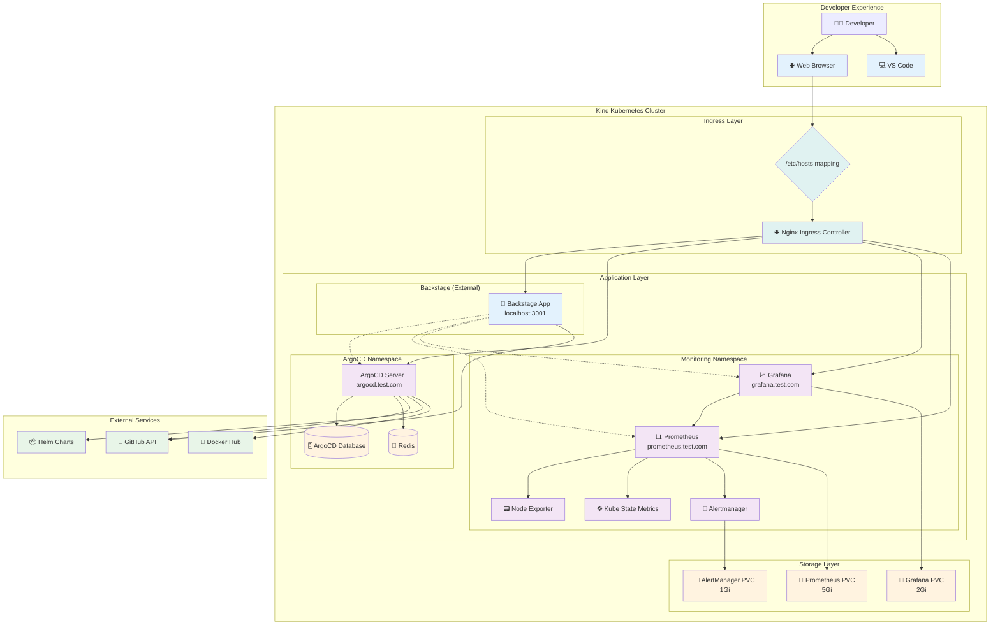
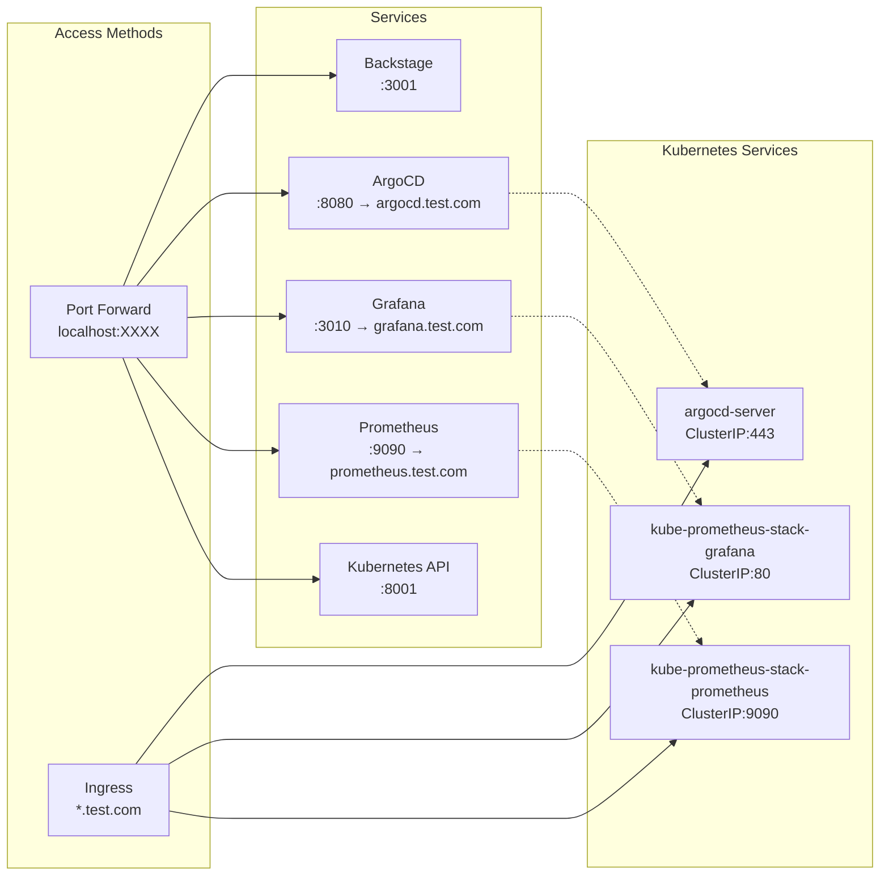
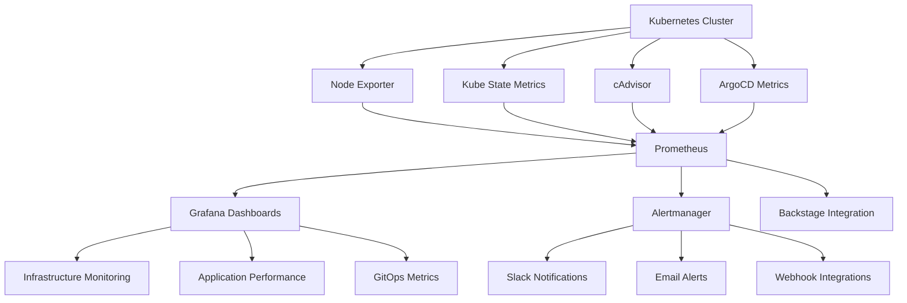
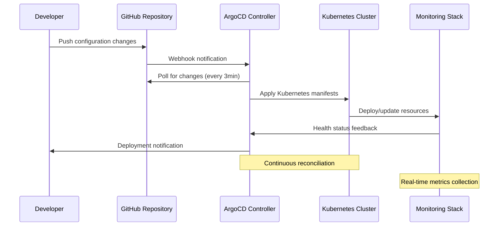

# 🚀 Backstage DevOps Platform - Complete Documentation

## 📋 Table of Contents

1. [Overview](#overview)
2. [Architecture](#architecture)
3. [Components](#components)
4. [Setup Guides](#setup-guides)
5. [Network Configuration](#network-configuration)
6. [Monitoring & Observability](#monitoring--observability)
7. [GitOps with ArgoCD](#gitops-with-argocd)
8. [Troubleshooting](#troubleshooting)
9. [Best Practices](#best-practices)

## 🎯 Overview

This is a comprehensive DevOps platform built around Backstage, providing:

- **Developer Portal**: Centralized service catalog and documentation
- **GitOps**: Automated deployments with ArgoCD
- **Monitoring**: Comprehensive observability with Prometheus and Grafana
- **Container Orchestration**: Kubernetes with Kind for local development
- **Service Discovery**: Ingress-based routing with custom domains

### Key Features
- ✅ **Single Pane of Glass**: All tools accessible from Backstage
- ✅ **Real-time Monitoring**: Live metrics and dashboards
- ✅ **GitOps Workflow**: Automated deployments via ArgoCD
- ✅ **Kubernetes Integration**: Real cluster data, not mocks
- ✅ **Custom Domains**: Clean URLs with ingress routing
- ✅ **Scalable Architecture**: Production-ready setup

## 🏛️ Architecture

### High-Level System Architecture



### Network Architecture



## 🧩 Components

### 1. Backstage Application (External)

**Location**: `localhost:3001` (Running outside Kubernetes)
**Purpose**: Developer portal and service catalog

#### Features:
- 🏠 **Home Dashboard**: Centralized information hub
- 📋 **Service Catalog**: Component and API registry
- 🏗️ **Software Templates**: Standardized project scaffolding
- 📖 **TechDocs**: Integrated documentation
- ☸️ **Kubernetes Integration**: Real-time cluster monitoring
- 🔄 **ArgoCD Integration**: GitOps application management
- 📊 **Observability**: Prometheus and Grafana integration

#### Plugins Installed:
```javascript
// Core Plugins
@backstage/plugin-catalog
@backstage/plugin-scaffolder
@backstage/plugin-techdocs
@backstage/plugin-kubernetes
@backstage/plugin-user-settings

// Custom Integrations
- Kubernetes Dashboard (Real data)
- ArgoCD Dashboard (Live applications)
- Prometheus Metrics (Real-time monitoring)
- Grafana Dashboards (Visualization)
```

### 2. ArgoCD (GitOps Platform)

**Namespace**: `argocd`
**Access**: `http://argocd.test.com` or `http://localhost:8080`
**Credentials**: `admin / Thomas#1109`

#### Applications Managed:
- `monitoring-stack`: Prometheus + Grafana Helm deployment
- `monitoring-ingress`: Ingress configurations for monitoring
- `python-app-*`: Various Python applications (demo)

#### Configuration:
```yaml
# ArgoCD Server Configuration
server:
  ingress:
    enabled: true
    hosts:
      - argocd.test.com
  rbacConfig:
    policy.default: role:readonly
    policy.csv: |
      p, role:admin, applications, *, */*, allow
      g, admin, role:admin
```

### 3. Prometheus (Metrics Collection)

**Namespace**: `monitoring`
**Access**: `http://prometheus.test.com` or `http://localhost:9090`
**Storage**: 5Gi persistent volume
**Retention**: 15 days

#### Metrics Sources:
- **Node Exporter**: Hardware and OS metrics
- **Kube State Metrics**: Kubernetes resource states
- **cAdvisor**: Container resource usage
- **ArgoCD Metrics**: Application deployment metrics

#### Key Metrics:
```promql
# Node metrics
node_cpu_seconds_total
node_memory_MemAvailable_bytes
node_filesystem_avail_bytes

# Kubernetes metrics
kube_pod_status_phase
kube_deployment_status_replicas
kube_service_info

# Custom application metrics
http_requests_total
application_up
deployment_frequency
```

### 4. Grafana (Visualization)

**Namespace**: `monitoring`
**Access**: `http://grafana.test.com` or `http://localhost:3010`
**Credentials**: `admin / admin123`
**Storage**: 2Gi persistent volume

#### Pre-configured Dashboards:
- **Kubernetes Cluster Overview**: Cluster health and resource usage
- **Node Exporter Full**: Detailed node metrics
- **ArgoCD Operational**: GitOps deployment metrics
- **Application Performance**: Custom application metrics

#### Data Sources:
```yaml
datasources:
  - name: Prometheus
    type: prometheus
    url: http://kube-prometheus-stack-prometheus.monitoring.svc.cluster.local:9090
    access: proxy
    isDefault: true
```

### 5. Kubernetes Cluster (Kind)

**Cluster Name**: `kind-kind`
**Nodes**: 1 control-plane node
**Network**: Docker bridge network

#### Namespaces:
- `argocd`: GitOps platform
- `monitoring`: Observability stack
- `default`: Default applications
- `kube-system`: Kubernetes system components

#### Storage Classes:
- `standard`: Local path provisioner (default)
- Persistent volumes automatically provisioned

### 6. Nginx Ingress Controller

**Purpose**: HTTP/HTTPS routing and load balancing

#### Ingress Rules:
```yaml
# ArgoCD Ingress
apiVersion: networking.k8s.io/v1
kind: Ingress
metadata:
  name: argocd-server-ingress
  namespace: argocd
spec:
  rules:
  - host: argocd.test.com
    http:
      paths:
      - path: /
        pathType: Prefix
        backend:
          service:
            name: argocd-server
            port:
              number: 443

# Monitoring Ingress
apiVersion: networking.k8s.io/v1
kind: Ingress
metadata:
  name: monitoring-ingress
  namespace: monitoring
spec:
  rules:
  - host: grafana.test.com
    http:
      paths:
      - path: /
        pathType: Prefix
        backend:
          service:
            name: kube-prometheus-stack-grafana
            port:
              number: 80
  - host: prometheus.test.com
    http:
      paths:
      - path: /
        pathType: Prefix
        backend:
          service:
            name: kube-prometheus-stack-prometheus
            port:
              number: 9090
```

## 🛠️ Setup Guides

### Prerequisites

```bash
# Required tools
- Docker Desktop
- kubectl
- helm
- kind
- Node.js 18+
- Yarn

# Verify installations
docker --version
kubectl version --client
helm version
kind version
node --version
yarn --version
```

### 1. Kubernetes Cluster Setup

```bash
# Create Kind cluster
kind create cluster --name kind

# Verify cluster
kubectl cluster-info
kubectl get nodes

# Install Nginx Ingress
kubectl apply -f https://raw.githubusercontent.com/kubernetes/ingress-nginx/main/deploy/static/provider/kind/deploy.yaml

# Wait for ingress to be ready
kubectl wait --namespace ingress-nginx \
  --for=condition=ready pod \
  --selector=app.kubernetes.io/component=controller \
  --timeout=90s
```

### 2. ArgoCD Installation

```bash
# Create namespace
kubectl create namespace argocd

# Install ArgoCD
kubectl apply -n argocd -f https://raw.githubusercontent.com/argoproj/argo-cd/stable/manifests/install.yaml

# Wait for pods to be ready
kubectl wait --for=condition=Ready pods --all -n argocd --timeout=300s

# Get initial admin password
kubectl -n argocd get secret argocd-initial-admin-secret -o jsonpath="{.data.password}" | base64 -d

# Apply ArgoCD ingress
kubectl apply -f kubernetes/argocd-ingress.yaml
```

### 3. Monitoring Stack Installation

```bash
# Add Helm repository
helm repo add prometheus-community https://prometheus-community.github.io/helm-charts
helm repo update

# Create monitoring namespace
kubectl create namespace monitoring

# Install kube-prometheus-stack
helm install kube-prometheus-stack prometheus-community/kube-prometheus-stack \
  --namespace monitoring \
  --set grafana.adminPassword="admin123" \
  --set prometheus.prometheusSpec.storageSpec.volumeClaimTemplate.spec.resources.requests.storage="5Gi" \
  --set grafana.persistence.enabled=true \
  --set grafana.persistence.size="2Gi"

# Apply monitoring ingress
kubectl apply -f kubernetes/ingress-monitoring.yaml
```

### 4. Backstage Setup

```bash
# Clone repository
git clone <your-repo-url>
cd backstage-app-devc/backstage

# Install dependencies
yarn install

# Configure environment variables
cp .env.example .env
# Edit .env with your configuration

# Start development server
yarn dev
```

### 5. Host Configuration

Add to `/etc/hosts`:
```
127.0.0.1 argocd.test.com
127.0.0.1 grafana.test.com
127.0.0.1 prometheus.test.com
```

## 🌐 Network Configuration

### Port Forwarding (Development)

```bash
# Kubernetes API proxy
kubectl proxy --port=8001 &

# ArgoCD server
kubectl port-forward svc/argocd-server -n argocd 8080:443 &

# Grafana (fallback)
kubectl port-forward svc/kube-prometheus-stack-grafana -n monitoring 3010:80 &

# Prometheus (fallback)
kubectl port-forward svc/kube-prometheus-stack-prometheus -n monitoring 9090:9090 &
```

### Service URLs

| Service | Ingress URL | Port Forward URL | Credentials |
|---------|-------------|------------------|-------------|
| Backstage | N/A | http://localhost:3001 | GitHub OAuth |
| ArgoCD | http://argocd.test.com | http://localhost:8080 | admin/Thomas#1109 |
| Grafana | http://grafana.test.com | http://localhost:3010 | admin/admin123 |
| Prometheus | http://prometheus.test.com | http://localhost:9090 | No auth |
| Kubernetes API | N/A | http://localhost:8001 | Service account |

### Environment Variables

```bash
# Backstage .env configuration
NODE_ENV=development

# GitHub Integration
GITHUB_TOKEN=your_github_token
AUTH_GITHUB_CLIENT_ID=your_oauth_client_id
AUTH_GITHUB_CLIENT_SECRET=your_oauth_client_secret

# ArgoCD Integration (via Ingress)
REACT_APP_ARGOCD_URL=http://argocd.test.com
REACT_APP_ARGOCD_USERNAME=admin
REACT_APP_ARGOCD_PASSWORD=Thomas#1109

# Kubernetes Integration
REACT_APP_KUBERNETES_URL=http://localhost:8001
CLUSTER_NAME=kind-kind

# Monitoring Integration (via Ingress)
REACT_APP_PROMETHEUS_URL=http://prometheus.test.com
REACT_APP_GRAFANA_URL=http://grafana.test.com
REACT_APP_GRAFANA_USERNAME=admin
REACT_APP_GRAFANA_PASSWORD=admin123

# Fallback URLs (port-forwards)
REACT_APP_PROMETHEUS_URL_LOCAL=http://localhost:9090
REACT_APP_GRAFANA_URL_LOCAL=http://localhost:3010
```

## 📊 Monitoring & Observability

### Metrics Collection Strategy



### Key Performance Indicators (KPIs)

#### Infrastructure Metrics
- **CPU Utilization**: Node and pod-level CPU usage
- **Memory Usage**: Available vs used memory
- **Disk I/O**: Read/write operations and latency
- **Network Traffic**: Ingress/egress bandwidth

#### Application Metrics
- **Request Rate**: HTTP requests per second
- **Error Rate**: 4xx/5xx error percentage
- **Response Time**: P50, P95, P99 latencies
- **Throughput**: Successful operations per minute

#### GitOps Metrics
- **Deployment Frequency**: Applications deployed per day
- **Lead Time**: Code commit to production time
- **Mean Time to Recovery**: Incident resolution time
- **Change Failure Rate**: Percentage of failed deployments

### Alerting Rules

```yaml
# High CPU Usage Alert
- alert: HighCPUUsage
  expr: 100 - (avg by (instance) (irate(node_cpu_seconds_total{mode="idle"}[5m])) * 100) > 80
  for: 5m
  labels:
    severity: warning
  annotations:
    summary: "High CPU usage detected"
    description: "CPU usage is above 80% for more than 5 minutes"

# Pod Crash Loop Alert
- alert: PodCrashLooping
  expr: rate(kube_pod_container_status_restarts_total[5m]) * 60 * 5 > 0
  for: 5m
  labels:
    severity: critical
  annotations:
    summary: "Pod is crash looping"
    description: "Pod {{ $labels.pod }} is restarting frequently"

# ArgoCD Sync Failed Alert
- alert: ArgoCDSyncFailed
  expr: argocd_app_info{sync_status!="Synced"} == 1
  for: 10m
  labels:
    severity: warning
  annotations:
    summary: "ArgoCD application sync failed"
    description: "Application {{ $labels.name }} sync status is {{ $labels.sync_status }}"
```

### Dashboard Categories

#### 1. Infrastructure Overview
- Cluster resource utilization
- Node health and performance
- Network traffic patterns
- Storage usage trends

#### 2. Application Performance
- Service-level objectives (SLOs)
- Error rate tracking
- Latency distributions
- Dependency health

#### 3. GitOps Operations
- Deployment success rates
- Application sync status
- Rollback frequency
- Configuration drift

## 🔄 GitOps with ArgoCD

### Application Structure

```
argocd-applications/
├── monitoring-stack.yaml      # Prometheus + Grafana Helm deployment
├── monitoring-ingress.yaml    # Ingress configurations
├── python-apps/               # Demo applications
│   ├── app-1.yaml
│   ├── app-10.yaml
│   └── ...
└── infrastructure/
    ├── ingress-controller.yaml
    └── cert-manager.yaml
```

### Application Definitions

```yaml
# monitoring-stack Application
apiVersion: argoproj.io/v1alpha1
kind: Application
metadata:
  name: monitoring-stack
  namespace: argocd
spec:
  project: default
  source:
    repoURL: https://prometheus-community.github.io/helm-charts
    chart: kube-prometheus-stack
    targetRevision: "*.*.x"
    helm:
      values: |
        grafana:
          adminPassword: admin123
          persistence:
            enabled: true
            size: 2Gi
        prometheus:
          prometheusSpec:
            storageSpec:
              volumeClaimTemplate:
                spec:
                  resources:
                    requests:
                      storage: 5Gi
  destination:
    server: https://kubernetes.default.svc
    namespace: monitoring
  syncPolicy:
    automated:
      prune: true
      selfHeal: true
```

### Deployment Workflow



## 🔧 Troubleshooting

### Common Issues

#### 1. Ingress Not Resolving

**Symptoms**: Cannot access `*.test.com` domains
**Solution**:
```bash
# Check /etc/hosts configuration
cat /etc/hosts | grep test.com

# Verify ingress controller
kubectl get pods -n ingress-nginx

# Check ingress rules
kubectl get ingress --all-namespaces

# Test with port-forward as fallback
kubectl port-forward svc/argocd-server -n argocd 8080:443
```

#### 2. Backstage Cannot Connect to Services

**Symptoms**: Mock data displayed instead of real data
**Solution**:
```bash
# Verify environment variables
cat backstage/.env | grep REACT_APP

# Check port-forwarding processes
ps aux | grep "port-forward"

# Test API endpoints manually
curl http://localhost:8001/api/v1/namespaces
curl http://localhost:8080/api/version
curl http://localhost:9090/api/v1/status/buildinfo
```

#### 3. Prometheus Not Collecting Metrics

**Symptoms**: Empty dashboards in Grafana
**Solution**:
```bash
# Check Prometheus targets
kubectl port-forward svc/kube-prometheus-stack-prometheus -n monitoring 9090:9090
# Navigate to http://localhost:9090/targets

# Verify service discovery
kubectl get servicemonitor -n monitoring
kubectl get endpoints -n monitoring

# Check pod logs
kubectl logs -n monitoring -l app.kubernetes.io/name=prometheus
```

#### 4. ArgoCD Applications Not Syncing

**Symptoms**: Applications stuck in "OutOfSync" status
**Solution**:
```bash
# Check ArgoCD server logs
kubectl logs -n argocd -l app.kubernetes.io/name=argocd-server

# Manually sync application
kubectl patch app monitoring-stack -n argocd --type merge -p '{"operation":{"sync":{"revision":"HEAD"}}}'

# Verify repository access
# Check GitHub token permissions
# Verify Helm repository availability
```

### Health Check Commands

```bash
# Overall cluster health
kubectl get nodes
kubectl get pods --all-namespaces --field-selector=status.phase!=Running

# ArgoCD health
kubectl get pods -n argocd
argocd app list

# Monitoring health
kubectl get pods -n monitoring
kubectl top nodes
kubectl top pods -n monitoring

# Backstage health (from backstage directory)
yarn test
yarn build
curl http://localhost:3001/api/health
```

## 📚 Best Practices

### 1. Security

- **Secrets Management**: Store sensitive data in Kubernetes secrets
- **RBAC**: Implement role-based access control
- **Network Policies**: Isolate namespaces and services
- **Image Security**: Scan containers for vulnerabilities
- **TLS Encryption**: Enable HTTPS for all services

### 2. Monitoring

- **Alerting Strategy**: Set up meaningful alerts with proper thresholds
- **Dashboard Design**: Create role-specific dashboards
- **Metrics Retention**: Balance storage costs with data retention needs
- **SLO/SLI Definition**: Establish service-level objectives

### 3. GitOps

- **Repository Structure**: Organize configurations logically
- **Environment Promotion**: Use branches for environment progression
- **Rollback Strategy**: Maintain deployment history for quick rollbacks
- **Configuration Validation**: Implement pre-deployment validation

### 4. Development

- **Plugin Development**: Follow Backstage plugin conventions
- **Code Quality**: Implement linting, testing, and formatting
- **Documentation**: Maintain up-to-date technical documentation
- **Version Management**: Use semantic versioning for releases

## 📈 Performance Optimization

### Backstage Performance

```bash
# Build optimization
yarn build:backend --config ../../app-config.yaml
yarn build --config ../../app-config.yaml

# Bundle analysis
yarn bundle-analyzer

# Database optimization
# Regular vacuum and analyze operations
# Index optimization for entity queries
```

### Kubernetes Performance

```bash
# Resource monitoring
kubectl top nodes
kubectl top pods --all-namespaces

# Resource limits and requests
# Set appropriate CPU and memory limits
# Use horizontal pod autoscaling for scalable workloads

# Storage optimization
# Use appropriate storage classes
# Monitor PVC usage and growth
```

### Monitoring Performance

```bash
# Prometheus optimization
# Adjust retention policies
# Configure recording rules for expensive queries
# Use federation for multi-cluster setups

# Grafana optimization
# Limit concurrent queries
# Use query caching
# Optimize dashboard queries
```

---

## 📝 Summary

This platform provides a complete DevOps experience with:

- **Real-time Monitoring**: Live metrics from actual Kubernetes cluster
- **GitOps Automation**: Continuous deployment via ArgoCD
- **Developer Experience**: Centralized portal with all tools integrated
- **Production Ready**: Scalable architecture with best practices
- **Comprehensive Documentation**: Complete setup and troubleshooting guides

### Quick Access URLs
- 🏠 **Backstage**: http://localhost:3001
- 🔄 **ArgoCD**: http://argocd.test.com (admin/Thomas#1109)
- 📊 **Prometheus**: http://prometheus.test.com
- 📈 **Grafana**: http://grafana.test.com (admin/admin123)

---

*📅 Last Updated: September 2025*
*👤 Author: DevOps Team*
*🔄 Version: 2.0 - Complete Platform*