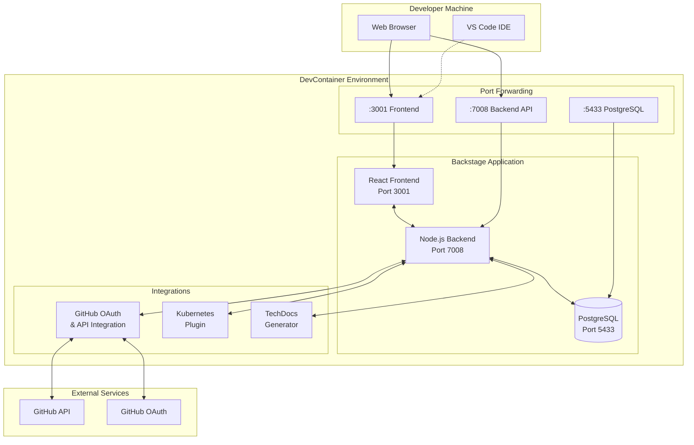

# 🎓 Backstage DevOps Course - Comprehensive Guide

**British Airways Training Environment**

## 📊 Architecture Overview



## 🏗️ Project Structure

```
backstage-app-devc/
├── .devcontainer/                    # DevContainer configuration
│   ├── devcontainer.json            # Main DevContainer config
│   ├── docker-compose.yml           # Multi-service orchestration
│   └── setup-course.sh              # Environment setup script
├── backstage/                       # Backstage application
│   ├── app-config.yaml             # Main Backstage configuration
│   ├── app-config.local.yaml       # Local development overrides
│   ├── .env                        # Environment variables
│   ├── packages/                   # Frontend and backend packages
│   │   ├── app/                    # React frontend
│   │   └── backend/                # Node.js backend
│   ├── catalog/                    # Entity definitions
│   └── plugins/                    # Custom plugins
├── docs/                           # Course documentation
├── examples/                       # Sample templates and entities
├── .env                           # Main environment file
└── README.md                      # Project overview
```

## ⚙️ Configuration Alignment

### Current Aligned Configuration:

| Component        | Configuration         | Value                      |
| ---------------- | --------------------- | -------------------------- |
| **Frontend**     | `app.baseUrl`         | `http://localhost:3001`    |
| **Frontend**     | `cors.origin`         | `http://localhost:3001`    |
| **Backend**      | `backend.baseUrl`     | `http://localhost:7008`    |
| **Backend**      | `backend.listen.port` | `7008`                     |
| **Database**     | `POSTGRES_PORT`       | `5433` (internal)          |
| **Database**     | Port Forward          | `5433` (external)          |
| **DevContainer** | `forwardPorts`        | `[3001, 7008, 5433, 8083]` |

### Environment Variables:

```bash
NODE_ENV=development
AUTH_GITHUB_CLIENT_ID='id auth github'
AUTH_GITHUB_CLIENT_SECRET='secret auth github'
GITHUB_TOKEN='token de github'
POSTGRES_HOST=postgres
POSTGRES_PORT=5433
POSTGRES_USER=backstage
POSTGRES_PASSWORD=backstage_password
POSTGRES_DB=backstage
BACKEND_SECRET=6846426d55b31c8bd355fa53a22ec75b0d966ac6e415678d6f2967815490e106
LOG_LEVEL=info
```

## 🚀 Complete Setup Guide

### Prerequisites

- **VS Code** with Dev Containers extension
- **Docker Desktop** running (minimum 4GB RAM allocated)
- **Git** for version control
- **GitHub Account** with OAuth app configured

### Step 1: Clone and Open Project

```bash
git clone <repository-url>
cd backstage-app-devc
code .
```

### Step 2: Configure GitHub OAuth

1. Go to GitHub Settings → Developer settings → OAuth Apps
2. Create new OAuth App:
   - **Application name**: `Backstage DevOps Course`
   - **Homepage URL**: `http://localhost:3001`
   - **Authorization callback URL**: `http://localhost:7008/api/auth/github/handler/frame`
3. Copy Client ID and Client Secret

### Step 3: Configure GitHub Personal Access Token

1. Go to GitHub Settings → Developer settings → Personal access tokens
2. Generate new token with scopes:
   - `repo` - Full repository access
   - `read:org` - Read organization membership
   - `read:user` - Read user profile
   - `user:email` - Read user email addresses
3. Copy the token

### Step 4: Configure Environment Variables

```bash
# Copy example environment file
cp .env.example .env

# Edit .env file with your values:
AUTH_GITHUB_CLIENT_ID=your_oauth_client_id
AUTH_GITHUB_CLIENT_SECRET=your_oauth_client_secret
GITHUB_TOKEN=your_personal_access_token
```

### Step 5: Open in DevContainer

```bash
# In VS Code Command Palette (Cmd/Ctrl+Shift+P):
"Dev Containers: Reopen in Container"
```

### Step 6: Setup and Start Application

```bash
# Inside DevContainer:
cd backstage
yarn install
yarn start
```

## 🎯 Execution Guide

### Starting the Application

```bash
# Navigate to backstage directory
cd /app/backstage

# Ensure environment variables are loaded
export $(cat .env | xargs) 2>/dev/null

# Start development server
yarn start
```

### Expected Output

```
Starting app, backend
Loaded config from app-config.yaml, app-config.local.yaml
<i> [webpack-dev-server] Project is running at:
<i> [webpack-dev-server] Loopback: http://localhost:3001/
2025-09-01T17:41:15.354Z rootHttpRouter info Listening on :7008
2025-09-01T17:41:15.426Z auth info Configuring auth provider: github
```

### Access Points

- **Frontend**: http://localhost:3001
- **Backend API**: http://localhost:7008
- **PostgreSQL**: localhost:5433
- **GitHub Auth**: http://localhost:7008/api/auth/github/start?env=development

## 🧪 Testing Guide

### 1. Basic Connectivity Tests

```bash
# Test frontend
curl http://localhost:3001
# Expected: HTML response with Backstage UI

# Test backend health
curl http://localhost:7008/api/catalog/entities
# Expected: JSON response with entities

# Test authentication endpoint
curl "http://localhost:7008/api/auth/github/start?env=development"
# Expected: Silent response (redirect)
```

### 2. GitHub Integration Tests

```bash
# Test GitHub API connectivity
curl -H "Authorization: token $GITHUB_TOKEN" https://api.github.com/user
# Expected: Your GitHub user information

# Test OAuth flow
curl "http://localhost:7008/api/auth/github/start?scope=read%3Auser&origin=http%3A%2F%2Flocalhost%3A3001&flow=popup&env=development"
# Expected: Redirect to GitHub OAuth
```

### 3. Database Connectivity Tests

```bash
# Connect to PostgreSQL
docker exec -it backstage-postgres psql -U backstage -d backstage

# Test queries
SELECT * FROM entities LIMIT 5;
\q
```

### 4. Frontend Functional Tests

1. Open http://localhost:3001 in browser
2. Click "Sign In" → Should redirect to GitHub
3. Complete OAuth flow → Should return to Backstage
4. Navigate to "Catalog" → Should show entities
5. Navigate to "Create" → Should show templates

## 🔧 Configuration Guide

### DevContainer Configuration

File: `.devcontainer/devcontainer.json`

```json
{
  "name": "Backstage DevOps Course - British Airways",
  "forwardPorts": [3001, 7008, 5433, 8083],
  "portsAttributes": {
    "3001": { "label": "Backstage Frontend" },
    "7008": { "label": "Backstage Backend API" },
    "5433": { "label": "PostgreSQL Database" }
  },
  "containerEnv": {
    "NODE_ENV": "development"
  }
}
```

### Backstage Main Configuration

File: `backstage/app-config.yaml`

```yaml
app:
  baseUrl: http://localhost:3001

backend:
  baseUrl: http://localhost:7008
  listen:
    port: 7008
  cors:
    origin: http://localhost:3001

auth:
  providers:
    github:
      development:
        clientId: ${AUTH_GITHUB_CLIENT_ID}
        clientSecret: ${AUTH_GITHUB_CLIENT_SECRET}
```

### Database Configuration

```yaml
database:
  client: pg
  connection:
    host: ${POSTGRES_HOST}
    port: ${POSTGRES_PORT}
    user: ${POSTGRES_USER}
    password: ${POSTGRES_PASSWORD}
    database: ${POSTGRES_DB}
```

## 🛠️ Troubleshooting Guide

### Common Issues and Solutions

#### 1. Port Connection Refused

**Problem**: `curl: (7) Failed to connect to localhost port XXXX: Connection refused`

**Solution**:

```bash
# Check if services are running
ps aux | grep node
netstat -tlnp | grep -E ":300[01]|:700[78]"

# Restart Backstage
cd /app/backstage && yarn start
```

#### 2. Auth Provider Not Found

**Problem**: `Unknown auth provider 'github'`

**Solutions**:

```bash
# Verify environment variables
echo $NODE_ENV  # Should be 'development'
echo $AUTH_GITHUB_CLIENT_ID

# Export variables if needed
export NODE_ENV=development
export $(cat .env | xargs) 2>/dev/null

# Restart application
yarn start
```

#### 3. DevContainer Port Forwarding

**Problem**: Cannot access from browser

**Solutions**:

1. Check VS Code **PORTS** tab
2. Manually add ports: 3001, 7008, 5433
3. Set ports as "Public" if needed
4. Restart DevContainer: `Cmd/Ctrl+Shift+P` → "Dev Containers: Rebuild Container"

#### 4. Database Connection Issues

**Problem**: Database connection errors

**Solutions**:

```bash
# Check PostgreSQL container
docker ps | grep postgres

# Test connection
docker exec backstage-postgres pg_isready -U backstage

# Reset database
docker-compose restart postgres
```

#### 5. GitHub OAuth Issues

**Problem**: OAuth flow fails

**Solutions**:

1. Verify OAuth app settings in GitHub:
   - Homepage URL: `http://localhost:3001`
   - Callback URL: `http://localhost:7008/api/auth/github/handler/frame`
2. Check GitHub token scopes
3. Verify environment variables

### Debug Commands

```bash
# View all container logs
docker-compose logs -f

# Check configuration
cat app-config.yaml | grep -E "baseUrl|port|origin"

# Test all endpoints
curl http://localhost:3001  # Frontend
curl http://localhost:7008/api/catalog/entities  # Backend
curl "http://localhost:7008/api/auth/github/start?env=development"  # Auth
```

## 📋 Quick Reference

### Essential Commands

```bash
# Start application
cd /app/backstage && yarn start

# Stop application
Ctrl+C

# Restart DevContainer
# VS Code: Cmd/Ctrl+Shift+P → "Dev Containers: Rebuild Container"

# View logs
docker-compose logs -f backstage-app

# Database access
docker exec -it backstage-postgres psql -U backstage -d backstage
```

### Key URLs

```
Frontend:     http://localhost:3001
Backend:      http://localhost:7008
Database:     localhost:5433
GitHub Auth:  http://localhost:7008/api/auth/github/start?env=development
```

### Environment Files

```
Main config:     .env
Backstage main:  backstage/app-config.yaml
Local overrides: backstage/app-config.local.yaml
DevContainer:    .devcontainer/devcontainer.json
```

## 🎓 Course Features

### Available Plugins

- **Catalog**: Service and component discovery
- **Scaffolder**: Software template system
- **TechDocs**: Documentation site generator
- **Auth**: GitHub OAuth integration
- **Kubernetes**: Resource visualization
- **Search**: Full-text search across entities

### Sample Entities

- **Systems**: Architectural systems
- **Components**: Microservices and applications
- **APIs**: Service interfaces
- **Resources**: Databases and infrastructure
- **Users/Groups**: Team organization

### Templates Available

- **React SSR Template**: Full-stack React application
- **Node.js Service**: Backend service template
- **Python Service**: Python application template
- **Static Site**: Documentation site template

## 📞 Support

**Course Instructor**: Jaime Henao  
**Email**: jaime.andres.henao.arbelaez@ba.com  
**Role**: DevOps Engineer - British Airways  
**GitHub**: [@jaime-henao](https://github.com/jaime-henao)

---

**Documentation Version**: 1.0  
**Last Updated**: September 2024  
**Backstage Version**: 1.33+  
**Maintained by**: DevOps Training Team - British Airways
