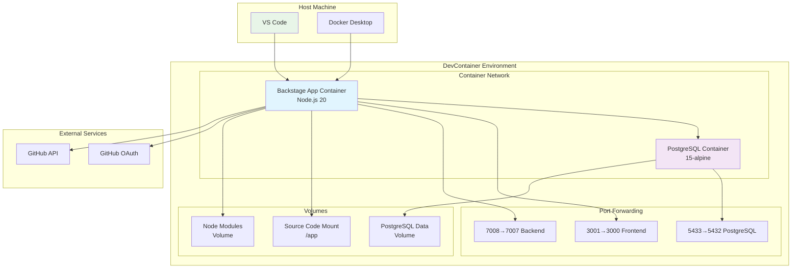
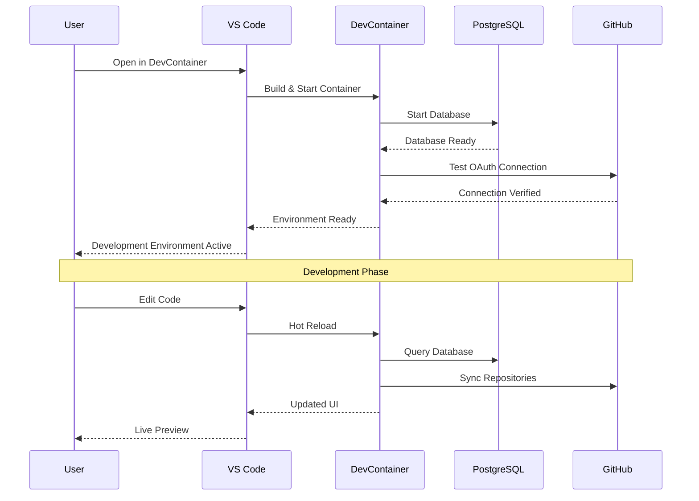
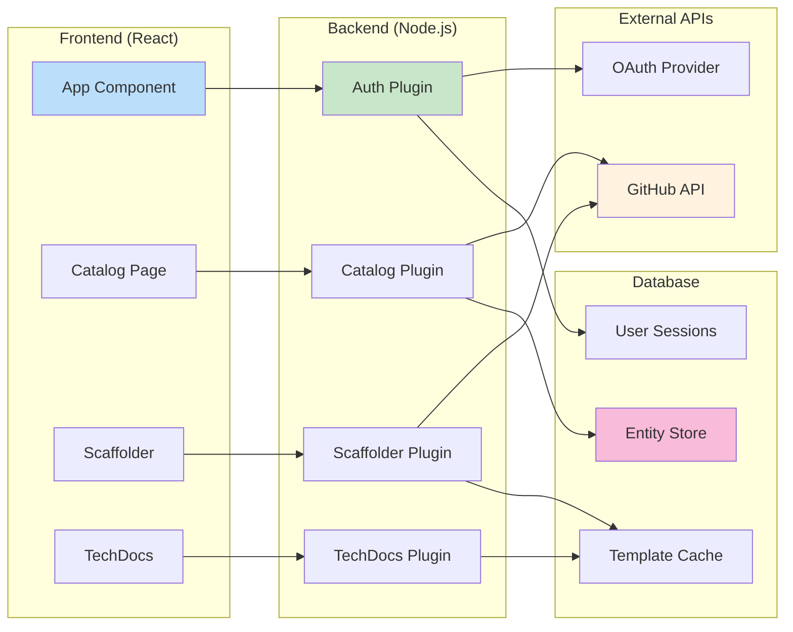

# 🐳 DevContainer Setup Guide

## Architecture Overview



## Service Flow Diagram



## Component Interaction



## Quick Start Commands

### 1. Setup Environment
```bash
# Run the DevContainer setup script
.devcontainer/setup-course.sh
```

### 2. Start Backstage Application
```bash
# Navigate to Backstage directory
cd backstage

# Install dependencies
yarn install

# Start development server
yarn dev
```

### 3. Access Points
- **Frontend**: http://localhost:3001
- **Backend**: http://localhost:7008  
- **Database**: localhost:5433

## DevContainer Features

### Pre-installed Extensions
- TypeScript/JavaScript development tools
- Docker and Kubernetes integration
- GitHub Actions and workflow support
- Code formatting and linting
- Python support for TechDocs

### Environment Variables
The DevContainer automatically loads:
```bash
POSTGRES_HOST=postgres
POSTGRES_PORT=5432
GITHUB_TOKEN=<configured_token>
AUTH_GITHUB_CLIENT_ID=<configured_id>
NODE_ENV=development
```

### Volume Mounts
- **Source Code**: Host directory → `/app`
- **Database**: Persistent volume for PostgreSQL data
- **Dependencies**: Node modules cached in volume

## Troubleshooting

### Common Issues

#### Port Conflicts
If ports are already in use:
```bash
# Check what's using the ports
lsof -i :3001
lsof -i :7008
lsof -i :5433

# Restart DevContainer
# Cmd+Shift+P → "Dev Containers: Rebuild Container"
```

#### Database Connection Issues
```bash
# Check PostgreSQL status
docker-compose -f .devcontainer/docker-compose.yml ps postgres

# View database logs  
docker-compose -f .devcontainer/docker-compose.yml logs postgres
```

#### GitHub Authentication
```bash
# Test GitHub token
curl -H "Authorization: token $GITHUB_TOKEN" https://api.github.com/user
```

### Reset Environment
```bash
# Complete reset (loses all data)
docker-compose -f .devcontainer/docker-compose.yml down -v
# Rebuild DevContainer in VS Code
```

## Development Workflow

### Code Changes
1. Edit files in VS Code
2. Backstage auto-reloads (if running `yarn dev`)
3. View changes at http://localhost:3001

### Database Changes
1. Connect: `psql -h localhost -p 5433 -U backstage`
2. Make schema changes
3. Restart Backstage backend if needed

### Adding Dependencies
```bash
# Frontend dependencies
cd packages/app
yarn add <package>

# Backend dependencies  
cd packages/backend
yarn add <package>

# Restart dev server
yarn dev
```

## Monitoring & Debugging

### Application Logs
```bash
# Backstage application logs
yarn dev --verbose

# Database logs
docker-compose -f .devcontainer/docker-compose.yml logs postgres
```

### Performance Monitoring
```bash
# Check resource usage
docker stats

# Database performance
psql -h localhost -p 5433 -U backstage -d backstage -c "EXPLAIN ANALYZE SELECT * FROM entities LIMIT 10;"
```

### Health Checks
```bash
# Backend health
curl http://localhost:7008/healthcheck

# Database connectivity
pg_isready -h localhost -p 5433 -U backstage
```

---
**Author**: Jaime Henao <jaime.andres.henao.arbelaez@ba.com>  
**Team**: DevOps Engineering - British Airways  
**Last Updated**: August 2025