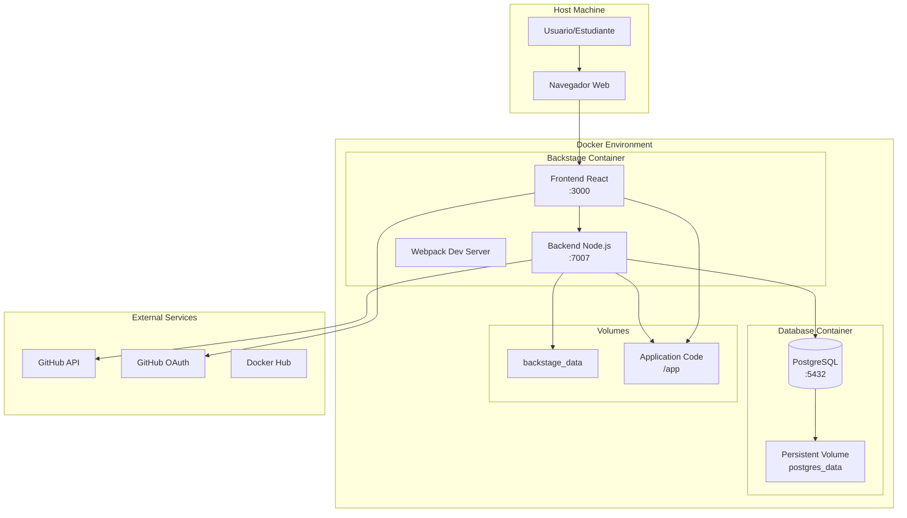

# 📋 Documentación Final del Setup - Backstage DevOps Course

## 🎯 Estado Actual del Proyecto

**✅ FUNCIONANDO CORRECTAMENTE**

- **Frontend**: http://localhost:3000 
- **Backend API**: http://localhost:7007
- **Database**: PostgreSQL persistente en puerto 5432
- **Integración GitHub**: Configurada con OAuth + Personal Access Token

---

## 🏗️ Arquitectura Final Implementada



## 📂 Estructura Final de Archivos

```
backstage-app/
├── 📁 Docker/                           # Configuración de contenedores
│   ├── 🐳 docker-compose.yml           # Orquestación multi-servicio
│   ├── 🐳 Dockerfile                   # Imagen personalizada de Backstage
│   ├── 🔐 .env                         # Variables de entorno (NO VERSIONAR)
│   ├── 🔧 setup-course.sh              # Script de configuración inicial
│   └── 🔑 generate-secrets.sh          # Generador de secrets seguros
│
├── 📁 backstage/                        # Aplicación Backstage principal
│   ├── 📝 app-config.yaml              # Configuración principal
│   ├── 📝 app-config.local.yaml        # Configuración local
│   ├── 📝 app-config.production.yaml   # Configuración de producción
│   ├── 📦 package.json                 # Dependencias raíz
│   ├── 📁 packages/                    # Frontend y Backend
│   │   ├── 📁 app/                     # Frontend React
│   │   └── 📁 backend/                 # Backend Node.js
│   ├── 📁 plugins/                     # Plugins personalizados
│   ├── 📁 catalog/                     # Definiciones de entidades
│   │   └── 📁 entities/
│   │       ├── 👥 users.yaml           # Usuarios del curso
│   │       ├── 👥 groups.yaml          # Grupos y equipos
│   │       └── 🏗️ systems.yaml         # Sistemas y componentes
│   └── 📁 examples/                    # Ejemplos y templates
│
├── 📁 python-app-1/                    # Aplicación de ejemplo
│   ├── 🐍 src/app.py                   # Flask API
│   ├── 📝 catalog-info.yaml            # Definición de entidad
│   ├── 🐳 Dockerfile                   # Imagen de la app
│   ├── 📁 k8s/                         # Manifiestos Kubernetes
│   ├── 📁 charts/                      # Helm charts
│   └── 📁 docs/                        # Documentación
│
├── 📁 docs/                             # Documentación del curso
│   ├── 📁 course/
│   │   ├── 📖 index.md                 # Índice principal
│   │   ├── 🏗️ architecture.md          # Documentación técnica
│   │   ├── 🔧 troubleshooting.md       # Guía de resolución
│   │   └── 📋 SETUP_FINAL.md           # Esta documentación
│   └── 📁 images/                      # Diagramas e imágenes
│
├── 📋 README.md                        # Documentación principal
├── 🚫 .gitignore                       # Archivos a ignorar por Git
└── 📄 LICENSE                          # Licencia del proyecto
```

---

## 🔧 Configuración Técnica Detallada

### 🗄️ Base de Datos PostgreSQL

**Configuración de Contenedor:**
```yaml
postgres:
  image: postgres:15-alpine
  container_name: backstage-postgres
  environment:
    POSTGRES_DB: backstage
    POSTGRES_USER: backstage
    POSTGRES_PASSWORD: backstage_password
  ports:
    - "5432:5432"
  volumes:
    - postgres_data:/var/lib/postgresql/data
  healthcheck:
    test: ["CMD-SHELL", "pg_isready -U backstage -d backstage"]
    interval: 30s
    timeout: 10s
    retries: 5
```

**Configuración en Backstage:**
```yaml
backend:
  database:
    client: pg
    connection:
      host: ${POSTGRES_HOST}
      port: ${POSTGRES_PORT}
      user: ${POSTGRES_USER}
      password: ${POSTGRES_PASSWORD}
      database: ${POSTGRES_DB}
      ssl: false  # Para desarrollo local
```

### 🔐 Autenticación GitHub

**Variables de Entorno Configuradas:**
```bash
# Token para GitHub API (repo, read:org, read:user, user:email)
GITHUB_TOKEN=ghp_your_github_personal_access_token_here

# OAuth App para login de usuarios
AUTH_GITHUB_CLIENT_ID=your_github_oauth_client_id
AUTH_GITHUB_CLIENT_SECRET=your_github_oauth_client_secret

# Secret para autenticación backend
BACKEND_SECRET=your_generated_backend_secret_here
```

**Configuración en app-config.yaml:**
```yaml
auth:
  environment: development
  providers:
    guest: {}
    github:
      development:
        clientId: ${AUTH_GITHUB_CLIENT_ID}
        clientSecret: ${AUTH_GITHUB_CLIENT_SECRET}
        signIn:
          resolvers:
            - resolver: emailMatchingUserEntityName
            - resolver: emailLocalPartMatchingUserEntityName

integrations:
  github:
    - host: github.com
      token: ${GITHUB_TOKEN}
```

### 📦 Catálogo y Proveedores

**Entity Providers Configurados:**
```yaml
catalog:
  providers:
    github:
      courseProvider:
        organization: 'jaime-henao'
        catalogPath: '/catalog-info.yaml'
        filters:
          branch: 'main'
          repository: '.*backstage.*'
        schedule:
          frequency: { minutes: 30 }
          timeout: { minutes: 3 }
          initialDelay: { seconds: 15 }
```

**Entidades Incluidas:**
- **Dominios**: `training` (Dominio de entrenamiento)
- **Sistemas**: `backstage-course` (Sistema principal del curso)
- **Componentes**: 
  - `backstage-frontend` (Frontend React)
  - `backstage-backend` (Backend Node.js)
  - `python-demo-app` (App de ejemplo)
- **APIs**:
  - `backstage-frontend-api`
  - `backstage-backend-api` 
  - `python-demo-api`
- **Resources**: `postgres-database`

---

## 🚀 Procesos y Servicios

### 🔄 Proceso de Inicio

1. **PostgreSQL Container**
   - Inicia primera con health check
   - Carga datos persistentes desde volumen
   - Escucha en puerto 5432

2. **Backstage Container**
   - Espera a que PostgreSQL esté healthy
   - Carga configuración desde app-config.yaml + .env
   - Inicia frontend (webpack-dev-server) en puerto 3000
   - Inicia backend (Node.js API) en puerto 7007

3. **Plugin Initialization**
   - Catalog backend (gestión de entidades)
   - Auth service (GitHub OAuth)
   - Scaffolder backend (templates)
   - TechDocs (documentación)
   - Search engine (indexación)
   - Permission system (autorización)

### 📊 Monitoreo y Logs

**Health Checks Disponibles:**
```bash
# Frontend (HTML response)
curl http://localhost:3000

# Backend API health 
curl http://localhost:7007/api/app/health

# Database connectivity
docker exec backstage-postgres pg_isready -U backstage
```

**Logs Estructurados:**
- JSON format con levels: info, warn, error
- Plugin-specific logging
- HTTP request/response tracking
- Database query logging (opcional)

---

## 🔐 Seguridad Implementada

### 🛡️ Medidas de Seguridad

1. **Secrets Management**
   - Variables sensibles en `.env` (no versionado)
   - Backend secret de 256 bits generado automáticamente
   - Tokens GitHub con permisos mínimos necesarios

2. **Database Security**
   - Usuario dedicado para Backstage
   - Password strong configurado
   - SSL deshabilitado solo para desarrollo local

3. **Network Security**
   - Contenedores en red aislada
   - Puertos expuestos solo los necesarios
   - CORS configurado para localhost

4. **Authentication & Authorization**
   - OAuth GitHub con scopes limitados
   - Session-based authentication
   - Permission system habilitado

### 🚫 Archivos Protegidos por .gitignore

- `.env` y variantes
- Credenciales y tokens
- Certificados SSL/TLS
- Node modules y builds
- Logs y archivos temporales
- Datos de base de datos
- Configuraciones locales sensibles

---

## 📈 Performance y Escalabilidad

### 🎯 Optimizaciones Implementadas

1. **Database Performance**
   - Connection pooling configurado
   - Índices automáticos de Backstage
   - Persistent volumes para evitar rebuild

2. **Frontend Performance**
   - Webpack dev server con hot reload
   - Module federation para plugins
   - Asset optimization

3. **Backend Performance**
   - Plugin lazy loading
   - Caching layers
   - Async processing para discovery

### 📊 Métricas Observadas

Durante startup típico:
- **Tiempo de inicio**: ~45-60 segundos
- **Memory usage**: ~512MB para backend, ~256MB para frontend
- **Database connections**: 5-20 (pool dinámico)
- **Plugin initialization**: 9 plugins estándar

---

## 🔄 Operaciones de Mantenimiento

### 📋 Tareas Regulares

1. **Backup Database**
   ```bash
   docker exec backstage-postgres pg_dump -U backstage backstage > backup-$(date +%Y%m%d).sql
   ```

2. **Update Dependencies**
   ```bash
   docker exec backstage-app bash -c "cd /app/backstage && yarn upgrade"
   ```

3. **Clean Docker Resources**
   ```bash
   docker system prune -f
   docker volume prune -f
   ```

4. **Rotate Secrets**
   ```bash
   cd Docker && ./generate-secrets.sh
   docker-compose restart backstage-app
   ```

### 🚨 Troubleshooting Commands

```bash
# Ver status de servicios
docker-compose ps

# Logs en tiempo real
docker-compose logs -f

# Conectar a base de datos
docker exec -it backstage-postgres psql -U backstage -d backstage

# Shell del contenedor
docker exec -it backstage-app bash

# Verificar configuración
docker exec backstage-app bash -c "cd /app/backstage && yarn backstage-cli config:check"
```

---

## 🎓 Información del Curso

**Instructor**: Jaime Henao (jaime.andres.henao.arbelaez@ba.com)  
**Organización**: British Airways - DevOps Training  
**Versión**: 1.0  
**Fecha**: Agosto 2024  
**Backstage Version**: 1.33+  

**Objetivos Alcanzados:**
- ✅ Entorno de desarrollo funcional
- ✅ Persistencia de datos configurada
- ✅ Integración GitHub completa
- ✅ Documentación comprehensiva
- ✅ Seguridad básica implementada
- ✅ Troubleshooting tools disponibles

---

**📞 Soporte**: Para issues técnicos, consultar [troubleshooting.md](./course/troubleshooting.md) o contactar al instructor.