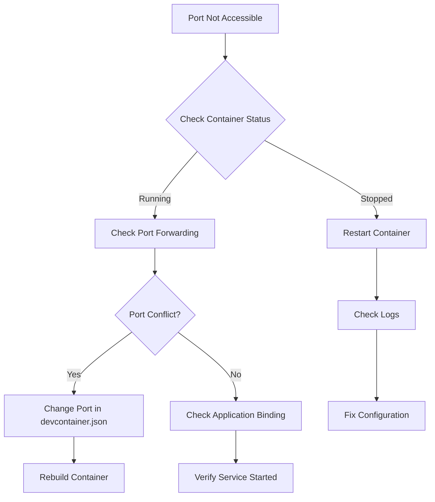
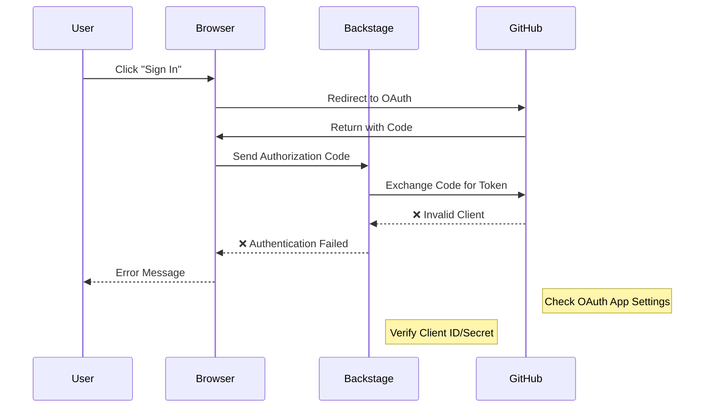

# 🔧 DevContainer Troubleshooting Guide

## Common Issues & Solutions

### DevContainer Issues

#### 1. DevContainer Fails to Build

```bash
# Error: "Failed to build devcontainer"
# Solution: Check Docker Desktop is running
docker --version
docker ps

# Rebuild container with no cache
# Cmd+Shift+P → "Dev Containers: Rebuild Container Without Cache"
```

#### 2. VS Code Can't Connect to DevContainer

```bash
# Error: "Failed to connect. The container may have stopped"
# Check container status
docker-compose -f .devcontainer/docker-compose.yml ps

# Restart services
docker-compose -f .devcontainer/docker-compose.yml restart
```

#### 3. Port Forwarding Not Working



```bash
# Check what's using ports
lsof -i :3001  # Frontend
lsof -i :7008  # Backend
lsof -i :5433  # Database

# Kill conflicting processes
kill -9 <PID>

# Check VS Code port forwarding
# View → Terminal → Ports tab
```

### Database Issues

#### 1. PostgreSQL Connection Failed

```bash
# Error: "Connection refused" or "Database not ready"

# Check PostgreSQL container status
docker-compose -f .devcontainer/docker-compose.yml ps postgres

# Check PostgreSQL logs
docker-compose -f .devcontainer/docker-compose.yml logs postgres

# Wait for health check
# PostgreSQL needs ~30 seconds to fully start

# Test connection manually
pg_isready -h postgres -p 5433 -U backstage
```

#### 2. Database Data Lost

```bash
# Issue: Entities disappear after restart
# Cause: Volume not properly mounted

# Check volume exists
docker volume ls | grep postgres

# Verify mount in docker-compose.yml
# Should have: - postgres_data:/var/lib/postgresql/data
```

#### 3. Permission Denied Errors

```bash
# Error: "Permission denied for database"
# Check user permissions
docker exec -it backstage-postgres-devc psql -U postgres -c "\du"

# Reset permissions if needed
docker exec -it backstage-postgres-devc psql -U postgres -c "GRANT ALL PRIVILEGES ON DATABASE backstage TO backstage;"
```

### Backstage Application Issues

#### 1. Yarn Install Fails

```bash
# Error: "Network timeout" or "EACCES permission denied"

# Clear yarn cache
yarn cache clean

# Delete node_modules and reinstall
rm -rf node_modules yarn.lock
yarn install

# Check Node.js version
node --version  # Should be 20.x
```

#### 2. Frontend Not Loading

```bash
# Error: "Cannot GET /" or blank page

# Check backend is running
curl http://localhost:7008/healthcheck

# Should return: {"status":"ok"}

# Check frontend build
cd packages/app
yarn build

# Start with verbose logging
yarn dev --verbose
```

#### 3. Hot Reload Not Working

```bash
# Issue: Changes not reflected automatically

# Enable polling for file changes
export CHOKIDAR_USEPOLLING=true

# Restart dev server
yarn dev

# Check file permissions
ls -la packages/app/src/
```

### GitHub Integration Issues

#### 1. OAuth Authentication Fails



```bash
# Error: "OAuth authentication failed"

# 1. Verify OAuth App Configuration
# Go to GitHub → Settings → Developer settings → OAuth Apps
# Check Application URLs:
#   - Homepage URL: http://localhost:3001
#   - Callback URL: http://localhost:7008/api/auth/github/handler/frame

# 2. Test GitHub token
curl -H "Authorization: token $GITHUB_TOKEN" https://api.github.com/user

# 3. Check environment variables
env | grep -E "AUTH_GITHUB|GITHUB_TOKEN"

# 4. Verify client credentials in .env
cat .devcontainer/.env
```

#### 2. Repository Discovery Not Working

```bash
# Error: "No repositories found" or "403 Forbidden"

# Check token scopes (needs: repo, read:org, read:user)
curl -H "Authorization: token $GITHUB_TOKEN" https://api.github.com/user/orgs

# Verify catalog configuration
grep -A 10 "github:" backstage/app-config.yaml

# Force refresh catalog
curl -X POST http://localhost:7008/api/catalog/refresh
```

#### 3. API Rate Limits

```bash
# Error: "API rate limit exceeded"

# Check current limits
curl -H "Authorization: token $GITHUB_TOKEN" https://api.github.com/rate_limit

# Use different token or wait for reset
# Configure caching in app-config.yaml:
catalog:
  providers:
    github:
      schedule:
        frequency:
          hours: 1  # Reduce frequency
```

### Performance Issues

#### 1. Slow Container Startup

```bash
# Issue: DevContainer takes too long to build

# Use multi-stage builds
# Optimize Dockerfile layers
# Pre-pull base images:
docker pull node:20-bullseye

# Check Docker Desktop resource allocation
# Settings → Resources → Advanced
# Recommended: 4GB RAM, 2 CPUs minimum
```

#### 2. High Memory Usage

```bash
# Monitor container resource usage
docker stats

# Optimize Node.js memory
export NODE_OPTIONS="--max-old-space-size=2048"

# Clean up development artifacts
yarn cache clean
rm -rf */node_modules/.cache
```

#### 3. Slow File Watching

```bash
# Issue: Changes take long to detect

# Enable polling (slower but more reliable)
export CHOKIDAR_USEPOLLING=true

# Adjust polling interval
export CHOKIDAR_INTERVAL=1000

# Exclude large directories from watching
# Add to .gitignore:
node_modules/
dist/
build/
```

### Development Workflow Issues

#### 1. Code Changes Not Saved

```bash
# Issue: VS Code not saving changes to container

# Check file sync status
# Status bar should show "Dev Container"

# Manually sync files
# Cmd+Shift+P → "File: Save All"

# Check mount permissions
ls -la /app/
```

#### 2. Extensions Not Working

```bash
# Issue: VS Code extensions not loading

# Check devcontainer.json extensions list
cat .devcontainer/devcontainer.json

# Reinstall extensions in container
# Cmd+Shift+P → "Extensions: Reload Extensions"

# Check extension compatibility
# Extensions tab → Filter by "Enabled"
```

#### 3. Terminal Issues

```bash
# Issue: Terminal not working or wrong shell

# Check default shell setting
echo $SHELL

# Reset terminal
# Cmd+Shift+P → "Terminal: Kill All Terminals"

# Verify user permissions
whoami
id
```

## Diagnostic Commands

### Complete System Check

```bash
#!/bin/bash
echo "=== DevContainer Diagnostic ==="
echo "Date: $(date)"
echo "User: $(whoami)"
echo "Working Directory: $(pwd)"
echo ""

echo "=== Container Info ==="
docker-compose -f .devcontainer/docker-compose.yml ps
echo ""

echo "=== Port Check ==="
ss -tlnp | grep -E "(3001|7008|5433)"
echo ""

echo "=== Environment ==="
env | grep -E "(GITHUB|POSTGRES|NODE|BACKEND)" | sort
echo ""

echo "=== Database Test ==="
pg_isready -h postgres -p 5433 -U backstage
echo ""

echo "=== GitHub API Test ==="
curl -s -H "Authorization: token $GITHUB_TOKEN" https://api.github.com/rate_limit | head -5
echo ""

echo "=== Node.js & Yarn ==="
node --version
yarn --version
echo ""

echo "=== Backstage Health ==="
curl -s http://localhost:7008/healthcheck 2>/dev/null || echo "Backend not responding"
```

### Clean Reset Procedure

```bash
#!/bin/bash
echo "🧹 Performing complete environment reset..."

# Stop all services
docker-compose -f .devcontainer/docker-compose.yml down -v

# Clean Docker
docker system prune -f
docker volume prune -f

# Clean Node.js
rm -rf node_modules
rm -rf backstage/node_modules
rm -rf backstage/packages/*/node_modules

# Clean caches
yarn cache clean

echo "✅ Environment cleaned. Rebuild DevContainer to continue."
```

## Getting Help

### 1. Enable Debug Logging

```bash
# Backstage debug mode
DEBUG=* yarn dev

# Docker compose debug
docker-compose -f .devcontainer/docker-compose.yml --verbose up
```

### 2. Collect Diagnostics

```bash
# Save diagnostic information
./diagnostic-check.sh > diagnostic-$(date +%Y%m%d-%H%M%S).log
```

### 3. Contact Support

- **Internal BA Team**: DevOps Slack #backstage-support
- **Instructor**: jaime.andres.henao.arbelaez@ba.com
- **GitHub Issues**: Repository issue tracker

---

**Remember**: Most issues can be resolved by rebuilding the DevContainer or restarting Docker Desktop.
