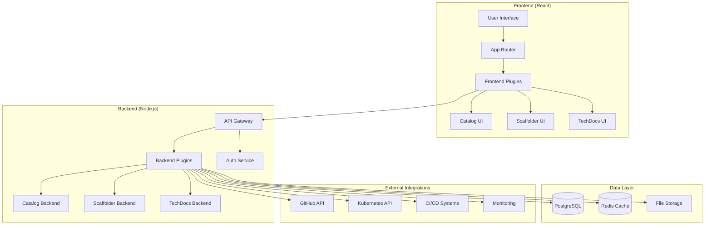
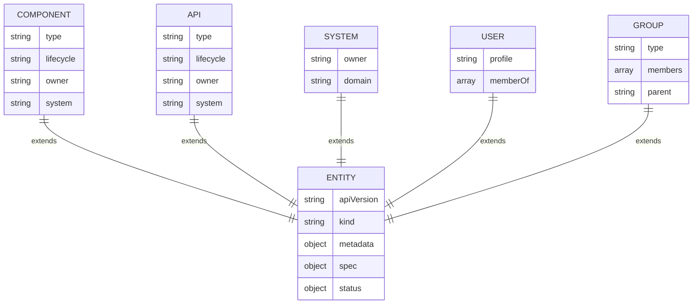
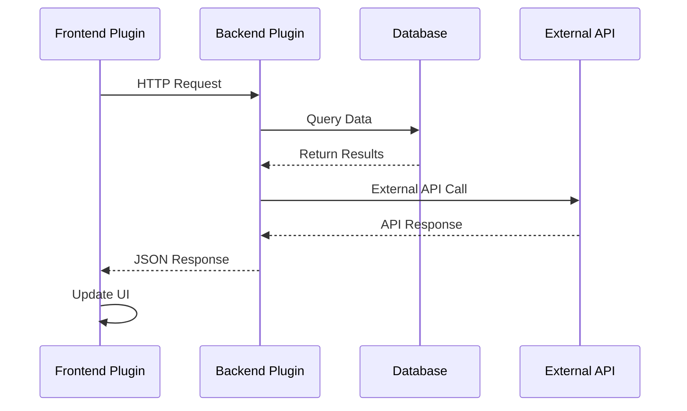
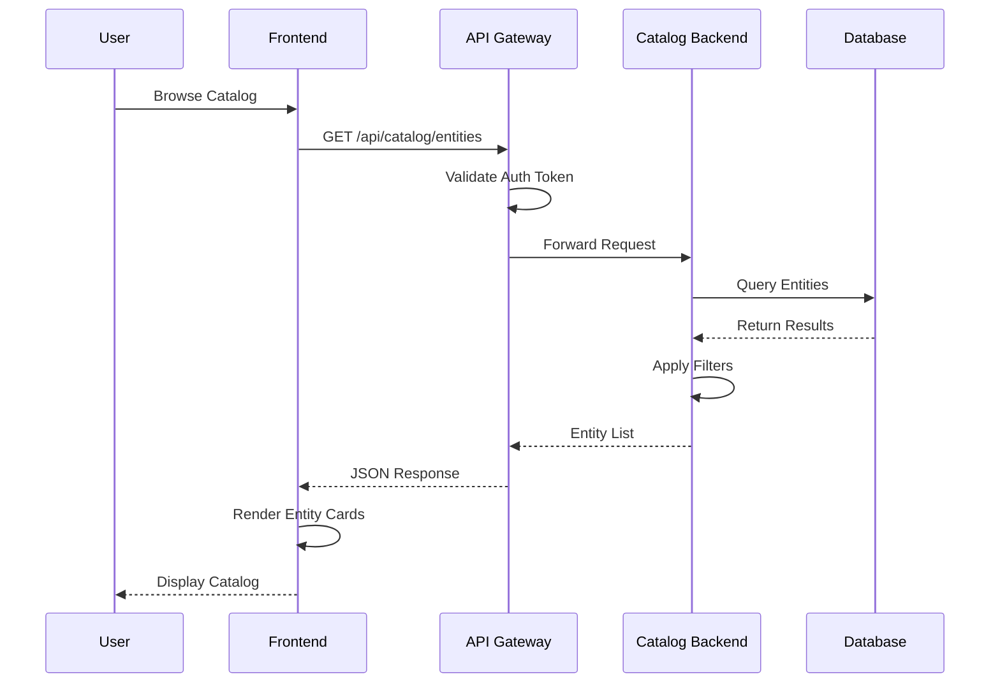
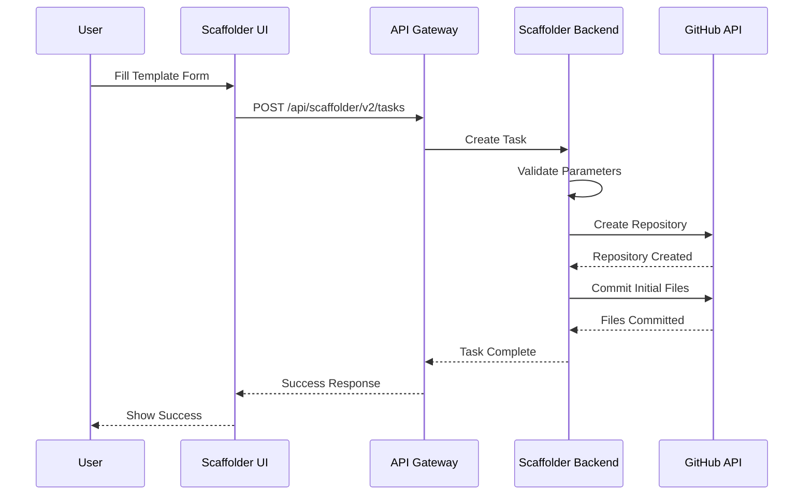
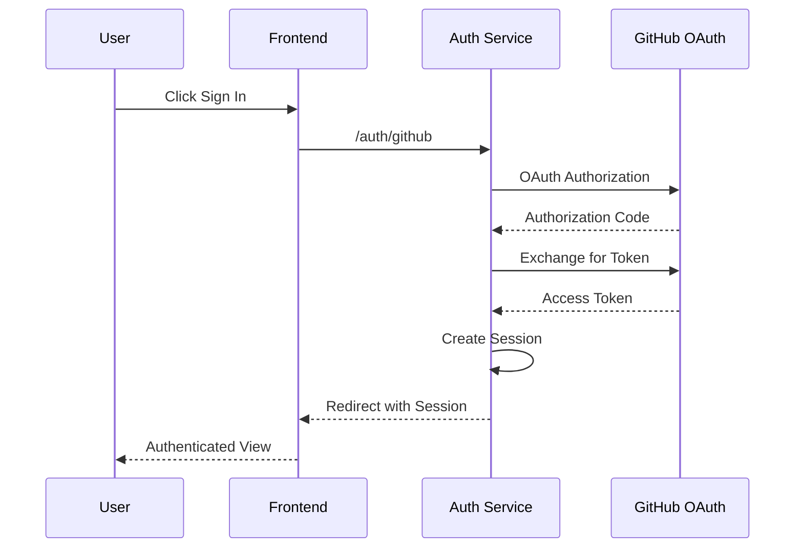
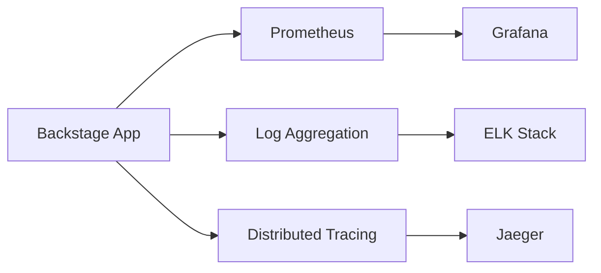

# Backstage Architecture Overview

## 🏗️ High-Level Architecture

Backstage follows a plugin-based architecture with clear separation between frontend and backend components.



## 🔧 Core Components

### Frontend Components

#### App Shell
- **Purpose**: Main application framework
- **Technology**: React 18+ with TypeScript
- **Responsibilities**:
  - Routing and navigation
  - Theme management
  - Plugin orchestration
  - Authentication state

#### Catalog Frontend
- **Purpose**: Service and component discovery
- **Features**:
  - Entity browsing and search
  - Dependency visualization
  - Ownership tracking
  - API documentation

#### Scaffolder Frontend  
- **Purpose**: Software template execution
- **Features**:
  - Template selection
  - Parameter input forms
  - Execution progress tracking
  - Repository creation

#### TechDocs Frontend
- **Purpose**: Documentation site
- **Features**:
  - Markdown rendering
  - Search functionality
  - Navigation menus
  - Asset management

### Backend Components

#### API Gateway
- **Purpose**: Request routing and middleware
- **Features**:
  - Authentication validation
  - Rate limiting
  - CORS handling
  - Request logging

#### Catalog Backend
- **Purpose**: Entity management and ingestion
- **Features**:
  - Entity processing
  - Location discovery
  - Validation rules
  - Change tracking

#### Scaffolder Backend
- **Purpose**: Template execution engine
- **Features**:
  - Action execution
  - Git operations
  - File manipulation
  - Webhook handling

#### Auth Service
- **Purpose**: Authentication and authorization
- **Supported Providers**:
  - GitHub OAuth
  - Google OAuth  
  - Microsoft Azure AD
  - Auth0
  - Custom OIDC

## 🗄️ Data Architecture

### Entity Model



### Database Schema

#### Core Tables
- **entities**: Main entity storage
- **entity_relations**: Relationships between entities  
- **locations**: Source locations for entities
- **refresh_state**: Entity refresh tracking

#### Plugin Tables
- **scaffolder_tasks**: Template execution history
- **search_index**: Full-text search index
- **permission_metadata**: Authorization metadata

## 🔌 Plugin Architecture

### Plugin Types

#### Frontend Plugins
```typescript
// Example plugin structure
export const plugin = createPlugin({
  id: 'my-plugin',
  routes: {
    root: rootRouteRef,
  },
  externalRoutes: {
    catalogEntity: catalogRouteRef,
  },
});
```

#### Backend Plugins
```typescript
// Example backend plugin
export async function createPlugin(): Promise<BackendFeature> {
  return createBackendPlugin({
    pluginId: 'my-plugin',
    register(env) {
      env.registerInit({
        deps: {
          httpRouter: coreServices.httpRouter,
          logger: coreServices.logger,
        },
        async init({ httpRouter, logger }) {
          // Plugin initialization
        },
      });
    },
  });
}
```

### Plugin Communication



## 🚦 Request Flow

### Catalog Entity Request



### Template Scaffolding Flow



## 🔐 Security Architecture

### Authentication Flow



### Authorization Model

- **Role-Based Access Control (RBAC)**
- **Resource-Based Permissions**
- **Policy Engine Integration**
- **Audit Logging**

## 📊 Monitoring & Observability

### Metrics Collection



### Key Metrics

- **Request Rate**: Requests per second
- **Response Time**: 95th percentile latency
- **Error Rate**: 4xx/5xx error percentage
- **Database Connections**: Active connection count
- **Memory Usage**: Heap and RSS memory
- **CPU Utilization**: Process CPU usage

## 🔄 Deployment Patterns

### Development Environment
- **Local**: Docker Compose setup
- **Hot Reload**: Webpack dev server
- **Database**: SQLite for simplicity

### Production Environment
- **Container**: Docker with multi-stage builds  
- **Orchestration**: Kubernetes deployment
- **Database**: PostgreSQL with replication
- **Load Balancing**: Ingress controller
- **Monitoring**: Prometheus + Grafana stack

---

**Next**: [Core Components Deep Dive](./components.md)