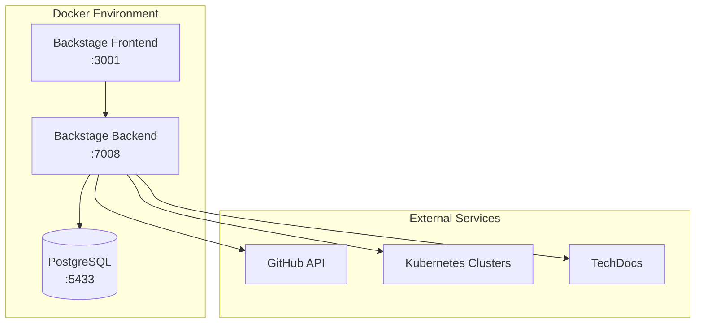

# Backstage DevOps Course - British Airways Training

## 🎯 Course Overview

This comprehensive Backstage course is designed for DevOps engineers at British Airways to understand and implement Backstage as a Developer Portal solution.

### What is Backstage?

Backstage is an open platform for building developer portals. Created by Spotify, it unifies all your infrastructure tooling, services, and documentation in a single, consistent UI.

### Course Objectives

By the end of this course, you will be able to:

- ✅ **Deploy and configure** a production-ready Backstage instance
- ✅ **Integrate** with GitHub, Kubernetes, and other DevOps tools  
- ✅ **Create and manage** software catalogs and templates
- ✅ **Implement** authentication and authorization
- ✅ **Troubleshoot** common issues and performance problems
- ✅ **Extend** Backstage with custom plugins and integrations

## 📚 Course Modules

### Module 1: Foundation & Architecture
- [Architecture Overview](./architecture.md)
- [Core Components](./components.md)
- [Installation & Setup](./installation.md)

### Module 2: Configuration & Integration
- [Database Configuration](./database.md)
- [GitHub Integration](./github-integration.md)
- [Authentication Setup](./authentication.md)

### Module 3: Software Catalog
- [Entity Model](./entity-model.md)
- [Catalog Management](./catalog-management.md)
- [Discovery & Registration](./discovery.md)

### Module 4: Templates & Scaffolding
- [Software Templates](./templates.md)
- [Custom Actions](./custom-actions.md)
- [Template Parameters](./template-parameters.md)

### Module 5: Kubernetes Integration
- [K8s Plugin Setup](./kubernetes-setup.md)
- [Resource Visualization](./k8s-visualization.md)
- [Multi-cluster Management](./multi-cluster.md)

### Module 6: Advanced Topics
- [Plugin Development](./plugin-development.md)
- [Custom Backend](./custom-backend.md)
- [Performance Optimization](./performance.md)

## 🏗️ Lab Environment

### Architecture Diagram



### Environment Components

| Component | Port | Purpose |
|-----------|------|---------|
| Backstage Frontend | 3001 | React-based UI |
| Backstage Backend | 7008 | Node.js API server |
| PostgreSQL | 5433 | Persistent data storage |
| TechDocs | Built-in | Documentation site generator |

## 🚀 Quick Start

1. **Clone the course repository**
   ```bash
   git clone https://github.com/jaime-henao/backstage-course
   cd backstage-course/Docker
   ```

2. **Run the setup script**
   ```bash
   ./setup-course.sh
   ```

3. **Start the environment**
   ```bash
   docker-compose up -d
   ```

4. **Access Backstage**
   - Open http://localhost:3001
   - Sign in with GitHub (configured)
   - Explore the software catalog

## 📖 Prerequisites

### Technical Requirements

- **Docker** 20.10+ and Docker Compose 2.0+
- **Node.js** 20+ (for local development)
- **Git** for version control
- **GitHub Account** with personal access token

### Knowledge Prerequisites

- Basic understanding of containerization
- Familiarity with Kubernetes concepts
- Experience with GitHub and Git workflows
- Understanding of CI/CD principles

## 🔗 Useful Links

- [Official Backstage Documentation](https://backstage.io/docs/)
- [Backstage GitHub Repository](https://github.com/backstage/backstage)
- [CNCF Backstage Project](https://www.cncf.io/projects/backstage/)
- [Course GitHub Repository](https://github.com/jaime-henao/backstage-course)

## 📞 Support

For questions or issues during the course:

- **Instructor**: Jaime Henao (jaime.andres.henao.arbelaez@ba.com)
- **GitHub Issues**: [Course Repository Issues](https://github.com/jaime-henao/backstage-course/issues)
- **Documentation**: [Troubleshooting Guide](./troubleshooting.md)

---

**Course Version**: 1.0  
**Last Updated**: August 2024  
**Duration**: 3 Days (24 hours total)  
**Level**: Intermediate